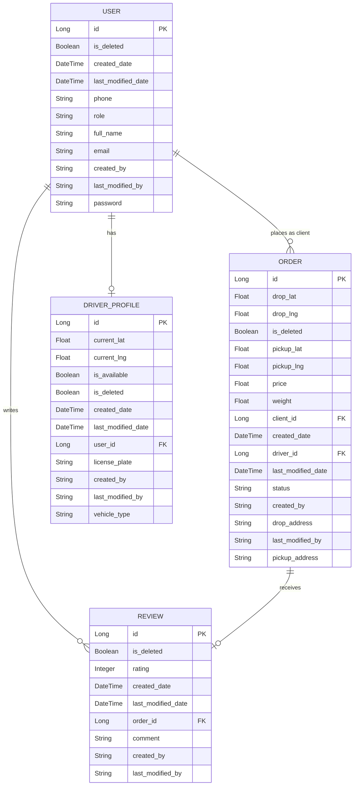

# 📦 Wasla App — Database Schema

## 🗄️ Database Schema

### Entity Relationships

---

### 📋 Table Descriptions

#### `users`
Stores all application users including both clients and drivers. The `role` field differentiates between user types.

| Column | Type | Description |
|---|---|---|
| `id` | Long | Primary key |
| `email` | String | Unique user email |
| `password` | String | Hashed password |
| `full_name` | String | User's full name |
| `phone` | String | Contact phone number |
| `role` | String | User role (`CLIENT`, `DRIVER`, etc.) |
| `is_deleted` | Boolean | Soft delete flag |
| `created_date` | DateTime | Record creation timestamp |
| `last_modified_date` | DateTime | Last update timestamp |
| `created_by` | String | Audit: creator reference |
| `last_modified_by` | String | Audit: last modifier reference |

---

#### `orders`
Represents a delivery order placed by a client and assigned to a driver.

| Column | Type | Description |
|---|---|---|
| `id` | Long | Primary key |
| `client_id` | Long (FK) | References `users.id` |
| `driver_id` | Long (FK) | References `users.id` |
| `pickup_lat` / `pickup_lng` | Float | Pickup GPS coordinates |
| `drop_lat` / `drop_lng` | Float | Drop-off GPS coordinates |
| `pickup_address` | String | Human-readable pickup address |
| `drop_address` | String | Human-readable drop-off address |
| `price` | Float | Order price |
| `weight` | Float | Package weight |
| `status` | String | Order status (`PENDING`, `IN_PROGRESS`, `DELIVERED`, etc.) |
| `is_deleted` | Boolean | Soft delete flag |
| `created_date` | DateTime | Record creation timestamp |
| `last_modified_date` | DateTime | Last update timestamp |
| `created_by` | String | Audit: creator reference |
| `last_modified_by` | String | Audit: last modifier reference |

---

#### `driver_profiles`
Extended profile data for drivers, including real-time location and vehicle info.

| Column | Type | Description |
|---|---|---|
| `id` | Long | Primary key |
| `user_id` | Long (FK) | References `users.id` |
| `current_lat` / `current_lng` | Float | Driver's current GPS location |
| `is_available` | Boolean | Whether the driver is available for orders |
| `license_plate` | String | Vehicle license plate |
| `vehicle_type` | String | Type of vehicle |
| `is_deleted` | Boolean | Soft delete flag |
| `created_date` | DateTime | Record creation timestamp |
| `last_modified_date` | DateTime | Last update timestamp |
| `created_by` | String | Audit: creator reference |
| `last_modified_by` | String | Audit: last modifier reference |

---

#### `reviews`
Customer reviews linked to a specific completed order.

| Column | Type | Description |
|---|---|---|
| `id` | Long | Primary key |
| `order_id` | Long (FK) | References `orders.id` |
| `rating` | Integer | Numeric rating score |
| `comment` | String | Optional review text |
| `is_deleted` | Boolean | Soft delete flag |
| `created_date` | DateTime | Record creation timestamp |
| `last_modified_date` | DateTime | Last update timestamp |
| `created_by` | String | Audit: creator reference |
| `last_modified_by` | String | Audit: last modifier reference |

---

### 🔗 Relationships Summary

| Relationship | Type | Description |
|---|---|---|
| `users` → `orders` (as client) | One-to-Many | A user can place many orders |
| `users` → `orders` (as driver) | One-to-Many | A driver can fulfill many orders |
| `users` → `driver_profiles` | One-to-One | A driver user has one profile |
| `orders` → `reviews` | One-to-One | Each order can have one review |
| `users` → `reviews` | One-to-Many | A user can write many reviews |
