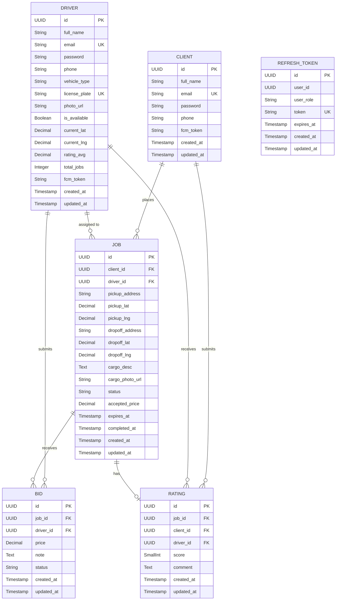

# Wasla Database Schema Documentation

**Version:** 2.0 (UUID-based)  
**Database:** PostgreSQL 16 with PostGIS 3.4  
**Last Updated:** March 29, 2026

## 📋 Table of Contents

- [Overview](#overview)
- [Entity Relationship Diagram](#entity-relationship-diagram)
- [Database Tables](#database-tables)
- [Relationships](#relationships)
- [Indexes](#indexes)
- [Constraints](#constraints)
- [Migration History](#migration-history)
- [Data Types](#data-types)

---

## 🎯 Overview

The Wasla database uses a **normalized relational schema** with the following characteristics:

- **Primary Keys:** UUID (universally unique identifiers)
- **Timestamps:** Automatic tracking with `created_at` and `updated_at`
- **Soft Deletes:** Removed in V2 (switched to hard deletes)
- **Referential Integrity:** Foreign key constraints with cascading rules
- **Indexing Strategy:** Optimized for common query patterns

### Key Design Decisions

1. **Separate Client and Driver Tables:** Denormalized for performance and clarity
2. **UUID Primary Keys:** Better for distributed systems and security
3. **Decimal for Money:** Precise financial calculations
4. **Geospatial Support:** PostGIS extension for location-based queries (ready but not yet implemented)
5. **Token Rotation:** Refresh tokens stored in database for security

---

## 🗄️ Database Schema

### Entity Relationships



### Relationship Cardinality

```
CLIENT (1) ────────────────────────────────────► (N) JOBS
    │
    └──────────────────────────────────────────► (N) RATINGS

DRIVER (1) ────────────────────────────────────► (N) JOBS (assigned)
    ├──────────────────────────────────────────► (N) BIDS
    └──────────────────────────────────────────► (N) RATINGS

JOB (1) ───────────────────────────────────────► (N) BIDS
    └──────────────────────────────────────────► (1) RATING

UNIQUE CONSTRAINTS:
- (job_id, driver_id) in BIDS  → One bid per driver per job
- job_id in RATINGS            → One rating per job
```

---

## 📋 Database Tables

### 1. CLIENTS

**Purpose:** Stores client (customer) profiles and authentication credentials.

| Column     | Type         | Constraints      | Description                    |
|------------|--------------|------------------|--------------------------------|
| id         | UUID         | PRIMARY KEY      | Unique client identifier       |
| full_name  | VARCHAR(100) | NOT NULL         | Client's full name             |
| email      | VARCHAR(100) | NOT NULL, UNIQUE | Login email (unique)           |
| password   | VARCHAR(255) | NOT NULL         | BCrypt hashed password         |
| phone      | VARCHAR(20)  | NOT NULL         | Contact phone number           |
| fcm_token  | VARCHAR(255) | NULL             | Firebase Cloud Messaging token |
| created_at | TIMESTAMP    | DEFAULT NOW()    | Account creation timestamp     |
| updated_at | TIMESTAMP    | DEFAULT NOW()    | Last update timestamp          |

**Relationships:**
- One-to-Many with `jobs` (as job creator)
- One-to-Many with `ratings` (as rater)

**Indexes:**
- Primary key index on `id`
- Unique index on `email`

---

### 2. DRIVERS

**Purpose:** Stores driver profiles, vehicle information, and real-time status.

| Column        | Type          | Constraints      | Description                    |
|---------------|---------------|------------------|--------------------------------|
| id            | UUID          | PRIMARY KEY      | Unique driver identifier       |
| full_name     | VARCHAR(100)  | NOT NULL         | Driver's full name             |
| email         | VARCHAR(100)  | NOT NULL, UNIQUE | Login email (unique)           |
| password      | VARCHAR(255)  | NOT NULL         | BCrypt hashed password         |
| phone         | VARCHAR(20)   | NOT NULL         | Contact phone number           |
| vehicle_type  | VARCHAR(30)   | NOT NULL         | Vehicle type (enum)            |
| license_plate | VARCHAR(20)   | NOT NULL, UNIQUE | Vehicle license plate (unique) |
| photo_url     | VARCHAR(255)  | NULL             | Driver profile photo URL       |
| is_available  | BOOLEAN       | DEFAULT FALSE    | Online/offline status          |
| current_lat   | DECIMAL(10,7) | NULL             | Current GPS latitude           |
| current_lng   | DECIMAL(10,7) | NULL             | Current GPS longitude          |
| rating_avg    | DECIMAL(3,2)  | DEFAULT 0.00     | Average rating (0.00–5.00)     |
| total_jobs    | INTEGER       | DEFAULT 0        | Total completed jobs count     |
| fcm_token     | VARCHAR(255)  | NULL             | Firebase Cloud Messaging token |
| created_at    | TIMESTAMP     | DEFAULT NOW()    | Account creation timestamp     |
| updated_at    | TIMESTAMP     | DEFAULT NOW()    | Last update timestamp          |

**Relationships:**
- One-to-Many with `jobs` (as assigned driver)
- One-to-Many with `bids` (as bidder)
- One-to-Many with `ratings` (as rated driver)

**Indexes:**
- Primary key index on `id`
- Unique index on `email`
- Unique index on `license_plate`
- Index on `is_available` (for finding available drivers)

**Vehicle Types (Enum):**
- `PICKUP_ONE_TON`
- `PICKUP_TWO_TON`
- `PICKUP_THREE_TON`
- `BOX_TRUCK_SMALL`
- `BOX_TRUCK_MEDIUM`
- `BOX_TRUCK_LARGE`

---

### 3. JOBS

**Purpose:** Core entity representing move requests from clients.

| Column          | Type          | Constraints              | Description                            |
|-----------------|---------------|--------------------------|----------------------------------------|
| id              | UUID          | PRIMARY KEY              | Unique job identifier                  |
| client_id       | UUID          | NOT NULL, FK             | Job creator (client)                   |
| driver_id       | UUID          | NULL, FK                 | Assigned driver (null until confirmed) |
| pickup_address  | VARCHAR(255)  | NOT NULL                 | Pickup location address                |
| pickup_lat      | DECIMAL(10,7) | NOT NULL                 | Pickup GPS latitude                    |
| pickup_lng      | DECIMAL(10,7) | NOT NULL                 | Pickup GPS longitude                   |
| dropoff_address | VARCHAR(255)  | NOT NULL                 | Dropoff location address               |
| dropoff_lat     | DECIMAL(10,7) | NOT NULL                 | Dropoff GPS latitude                   |
| dropoff_lng     | DECIMAL(10,7) | NOT NULL                 | Dropoff GPS longitude                  |
| cargo_desc      | TEXT          | NULL                     | Cargo description                      |
| cargo_photo_url | VARCHAR(255)  | NULL                     | Cargo photo URL                        |
| status          | VARCHAR(20)   | NOT NULL, DEFAULT 'OPEN' | Job status (enum)                      |
| accepted_price  | DECIMAL(10,2) | NULL                     | Accepted bid price                     |
| expires_at      | TIMESTAMP     | NOT NULL                 | Job expiry time (30 min default)       |
| completed_at    | TIMESTAMP     | NULL                     | Job completion timestamp               |
| created_at      | TIMESTAMP     | DEFAULT NOW()            | Job creation timestamp                 |
| updated_at      | TIMESTAMP     | DEFAULT NOW()            | Last update timestamp                  |

**Relationships:**
- Many-to-One with `clients` (job owner)
- Many-to-One with `drivers` (assigned driver, nullable)
- One-to-Many with `bids` (price quotes)
- One-to-One with `ratings` (post-job feedback)

**Indexes:**
- Primary key index on `id`
- Index on `status` (for filtering by status)
- Index on `client_id` (for client's job history)
- Index on `driver_id` (for driver's job history)
- Index on `expires_at` (for expiry scheduler)

**Job Status (Enum):**
- `OPEN` — Newly created, awaiting bids
- `BIDDING` — Has received at least one bid
- `CONFIRMED` — Bid accepted, driver assigned
- `IN_PROGRESS` — Driver started the job
- `COMPLETED` — Job finished
- `EXPIRED` — No bid accepted within time limit
- `CANCELLED` — Cancelled by client or driver

**Status Transitions:**
```
OPEN → BIDDING → CONFIRMED → IN_PROGRESS → COMPLETED
  ↓
EXPIRED (if no bid accepted within 30 minutes)
  ↓
CANCELLED (manual cancellation)
```

---

### 4. BIDS

**Purpose:** Driver price quotes on jobs.

| Column     | Type          | Constraints                 | Description               |
|------------|---------------|-----------------------------|---------------------------|
| id         | UUID          | PRIMARY KEY                 | Unique bid identifier     |
| job_id     | UUID          | NOT NULL, FK                | Job being bid on          |
| driver_id  | UUID          | NOT NULL, FK                | Driver submitting bid     |
| price      | DECIMAL(10,2) | NOT NULL                    | Bid price amount          |
| note       | TEXT          | NULL                        | Optional bid note/message |
| status     | VARCHAR(20)   | NOT NULL, DEFAULT 'PENDING' | Bid status (enum)         |
| created_at | TIMESTAMP     | DEFAULT NOW()               | Bid submission timestamp  |
| updated_at | TIMESTAMP     | DEFAULT NOW()               | Last update timestamp     |

**Relationships:**
- Many-to-One with `jobs` (bid target)
- Many-to-One with `drivers` (bidder)

**Constraints:**
- UNIQUE `(job_id, driver_id)` — One bid per driver per job

**Indexes:**
- Primary key index on `id`
- Index on `job_id` (for fetching job bids)
- Index on `driver_id` (for driver's bid history)
- Unique composite index on `(job_id, driver_id)`

**Bid Status (Enum):**
- `PENDING` — Awaiting client decision
- `ACCEPTED` — Bid accepted by client
- `WITHDRAWN` — Automatically withdrawn when another bid is accepted

---

### 5. RATINGS

**Purpose:** Client feedback on completed jobs.

| Column     | Type      | Constraints           | Description                    |
|------------|-----------|-----------------------|--------------------------------|
| id         | UUID      | PRIMARY KEY           | Unique rating identifier       |
| job_id     | UUID      | NOT NULL, UNIQUE, FK  | Rated job (one rating per job) |
| client_id  | UUID      | NOT NULL, FK          | Client who submitted rating    |
| driver_id  | UUID      | NOT NULL, FK          | Driver being rated             |
| score      | SMALLINT  | NOT NULL, CHECK (1-5) | Rating score (1–5 stars)       |
| comment    | TEXT      | NULL                  | Optional rating comment        |
| created_at | TIMESTAMP | DEFAULT NOW()         | Rating submission timestamp    |
| updated_at | TIMESTAMP | DEFAULT NOW()         | Last update timestamp          |

**Relationships:**
- One-to-One with `jobs` (rated job)
- Many-to-One with `clients` (rater)
- Many-to-One with `drivers` (rated driver)

**Constraints:**
- UNIQUE `(job_id)` — One rating per job
- CHECK `(score BETWEEN 1 AND 5)`

**Indexes:**
- Primary key index on `id`
- Unique index on `job_id`
- Index on `driver_id` (for driver's rating history)

**Business Logic:**
- Rating triggers automatic update of `drivers.rating_avg`
- Rating triggers increment of `drivers.total_jobs`

---

### 6. REFRESH_TOKENS

**Purpose:** Persistent storage for JWT refresh tokens (token rotation mechanism).

| Column     | Type         | Constraints      | Description                    |
|------------|--------------|------------------|--------------------------------|
| id         | UUID         | PRIMARY KEY      | Unique token identifier        |
| user_id    | UUID         | NOT NULL         | User (client or driver) ID     |
| user_role  | VARCHAR(20)  | NOT NULL         | User role (`CLIENT`, `DRIVER`) |
| token      | VARCHAR(512) | NOT NULL, UNIQUE | Refresh token string           |
| expires_at | TIMESTAMP    | NOT NULL         | Token expiry timestamp         |
| created_at | TIMESTAMP    | DEFAULT NOW()    | Token creation timestamp       |
| updated_at | TIMESTAMP    | DEFAULT NOW()    | Last update timestamp          |

**Relationships:**
- References `clients.id` or `drivers.id` via `user_id` (polymorphic)

**Indexes:**
- Primary key index on `id`
- Unique index on `token`
- Index on `user_id` (for user token lookup)

**Token Lifecycle:**
- Created on login/register
- Validated on refresh request
- Deleted on logout
- Rotated on refresh (old token deleted, new token created)
- Expires after 30 days

---

## 🔗 Relationships

### Relationship Summary Table

| Parent Table | Child Table | Relationship | Foreign Key | Cascade Rule |
|--------------|-------------|--------------|-------------|--------------|
| clients      | jobs        | 1:N          | client_id   | RESTRICT     |
| clients      | ratings     | 1:N          | client_id   | RESTRICT     |
| drivers      | jobs        | 1:N          | driver_id   | SET NULL     |
| drivers      | bids        | 1:N          | driver_id   | RESTRICT     |
| drivers      | ratings     | 1:N          | driver_id   | RESTRICT     |
| jobs         | bids        | 1:N          | job_id      | CASCADE      |
| jobs         | ratings     | 1:1          | job_id      | CASCADE      |

### Relationship Details

#### CLIENT → JOBS (1:N)
- **Foreign Key:** `jobs.client_id` → `clients.id`
- **Cascade:** RESTRICT (cannot delete client with active jobs)

#### CLIENT → RATINGS (1:N)
- **Foreign Key:** `ratings.client_id` → `clients.id`
- **Cascade:** RESTRICT (cannot delete client with ratings)

#### DRIVER → JOBS (1:N)
- **Foreign Key:** `jobs.driver_id` → `drivers.id`
- **Cascade:** SET NULL (if driver deleted, `jobs.driver_id` becomes null)
- **Nullable:** Yes (job may not have an assigned driver yet)

#### DRIVER → BIDS (1:N)
- **Foreign Key:** `bids.driver_id` → `drivers.id`
- **Cascade:** RESTRICT (cannot delete driver with active bids)

#### DRIVER → RATINGS (1:N)
- **Foreign Key:** `ratings.driver_id` → `drivers.id`
- **Cascade:** RESTRICT (cannot delete driver with ratings)

#### JOB → BIDS (1:N)
- **Foreign Key:** `bids.job_id` → `jobs.id`
- **Cascade:** CASCADE (deleting job deletes all bids)

#### JOB → RATING (1:1)
- **Foreign Key:** `ratings.job_id` → `jobs.id`
- **Cascade:** CASCADE (deleting job deletes rating)
- **Unique:** Yes (one rating per job)

---

## 📇 Indexes

### Primary Key Indexes (Automatic)
- `clients.id`, `drivers.id`, `jobs.id`, `bids.id`, `ratings.id`, `refresh_tokens.id`

### Unique Indexes
- `clients.email` — Login lookup
- `drivers.email` — Login lookup
- `drivers.license_plate` — Vehicle uniqueness
- `bids(job_id, driver_id)` — One bid per driver per job
- `ratings.job_id` — One rating per job
- `refresh_tokens.token` — Token validation

### Query Optimization Indexes
- `jobs.status` — Filter jobs by status
- `jobs.client_id` — Client's job history
- `jobs.driver_id` — Driver's job history
- `jobs.expires_at` — Job expiry scheduler
- `bids.job_id` — Fetch bids for a job
- `bids.driver_id` — Driver's bid history
- `ratings.driver_id` — Driver's rating history
- `refresh_tokens.user_id` — User token lookup

### Future Indexes (Geospatial)
- `drivers(current_lat, current_lng)` — Spatial index for nearby driver queries
- `jobs(pickup_lat, pickup_lng)` — Spatial index for nearby job queries

---

## 🔒 Constraints

### Primary Key Constraints
All tables use UUID primary keys for global uniqueness, security (non-sequential), and distributed system compatibility.

### Foreign Key Constraints
- **RESTRICT** — Prevents deletion if referenced (`clients`, `drivers`)
- **CASCADE** — Deletes child records (`jobs → bids`, `jobs → ratings`)
- **SET NULL** — Nullifies reference (`jobs.driver_id`)

### Unique Constraints
- `clients.email` — No duplicate emails
- `drivers.email` — No duplicate emails
- `drivers.license_plate` — No duplicate vehicles
- `bids(job_id, driver_id)` — One bid per driver per job
- `ratings.job_id` — One rating per job
- `refresh_tokens.token` — Unique tokens

### Check Constraints
- `ratings.score BETWEEN 1 AND 5` — Valid rating range

### Not Null Constraints
- All primary keys
- All foreign keys (except nullable `jobs.driver_id`)
- Authentication fields (`email`, `password`)
- Required business fields (addresses, coordinates, status)

---

## 📜 Migration History

### V1: Initial Schema (BIGSERIAL IDs)
**Description:** First database schema with auto-increment IDs.

**Key Features:**
- Unified `users` table with role-based access
- Separate `driver_profiles` table (1:1 with users)
- BIGSERIAL primary keys
- Soft delete support (`is_deleted` flag)
- Audit fields (`created_by`, `last_modified_by`)

**Tables:** `users`, `driver_profiles`, `jobs`, `bids`, `ratings`, `refresh_tokens`

---

### V2: UUID Refactoring *(Current)*
**Date:** March 2026  
**Description:** Major refactoring to UUID-based separate entities.

**Key Changes:**
1. ✅ Split `users` into `clients` and `drivers` tables
2. ✅ Merged `driver_profiles` into `drivers` (denormalized)
3. ✅ Migrated all IDs from BIGSERIAL to UUID
4. ✅ Removed soft delete fields (`is_deleted`)
5. ✅ Removed audit fields (`created_by`, `last_modified_by`)
6. ✅ Preserved all data integrity during migration
7. ✅ Updated all foreign key relationships
8. ✅ Recreated indexes for new schema

**Migration Strategy:**
- Created temporary mapping tables for ID conversion
- Migrated data in stages: `clients → drivers → jobs → bids → ratings`
- Dropped old tables after successful migration
- Added foreign key constraints and recreated indexes

**Data Preservation:**
- ✅ All client, driver, job, bid, and rating data migrated
- ✅ Active refresh tokens migrated

---

## 🔢 Data Types

| Type          | Used For                                 |
|---------------|------------------------------------------|
| UUID          | Primary keys and foreign keys            |
| DECIMAL(10,2) | Money values (`price`, `accepted_price`) |
| DECIMAL(3,2)  | Rating average (`0.00–5.00`)             |
| DECIMAL(10,7) | GPS coordinates (latitude, longitude)    |
| INTEGER       | Counters (`total_jobs`)                  |
| SMALLINT      | Rating score (`1–5`)                     |
| VARCHAR(20)   | Short strings (`phone`, `license_plate`) |
| VARCHAR(30)   | Enum-like strings (`vehicle_type`)       |
| VARCHAR(100)  | Names and emails                         |
| VARCHAR(255)  | URLs and addresses                       |
| VARCHAR(512)  | Tokens                                   |
| TEXT          | Long text (`cargo_desc`, `comment`)      |
| BOOLEAN       | Flags (`is_available`)                   |
| TIMESTAMP     | All date/time fields                     |

### Why These Choices?

**UUID vs BIGSERIAL:**
- ✅ Better for distributed systems, non-sequential (security), globally unique
- ❌ Slightly larger storage (16 bytes vs 8 bytes)

**DECIMAL vs FLOAT:**
- ✅ Exact precision for money, no rounding errors, financial compliance

**VARCHAR vs TEXT:**
- ✅ VARCHAR for known-length fields (performance), TEXT for unlimited length (flexibility)

---

## 📊 Database Statistics

### Estimated Table Sizes

| Table          | Columns | Indexes | Avg Row Size | Growth Rate |
|----------------|---------|---------|--------------|-------------|
| clients        | 8       | 2       | ~200 bytes   | Low         |
| drivers        | 14      | 4       | ~300 bytes   | Low         |
| jobs           | 16      | 5       | ~400 bytes   | High        |
| bids           | 8       | 3       | ~150 bytes   | High        |
| ratings        | 8       | 3       | ~200 bytes   | Medium      |
| refresh_tokens | 7       | 3       | ~600 bytes   | Medium      |

### Query Performance

**Fast Queries (Indexed):**
- ✅ Find user by email
- ✅ Find jobs by status / client / driver
- ✅ Find bids for a job
- ✅ Find driver ratings
- ✅ Validate refresh token

**Potentially Slow Queries (Not Yet Optimized):**
- ⚠️ Find nearby drivers (needs spatial index)
- ⚠️ Find nearby jobs (needs spatial index)
- ⚠️ Complex aggregations without proper indexes

---

## 🔮 Future Enhancements

1. **Geospatial Indexes** — PostGIS spatial indexes for nearby driver/job searches
2. **Partitioning** — Partition `jobs` by date; archive old completed jobs
3. **Materialized Views** — Driver statistics, job analytics (average price, popular routes)
4. **Full-Text Search** — Search jobs by cargo description, drivers by name
5. **Audit Logging** — Track all data modifications for compliance and debugging

---

## 📝 Notes

### Best Practices
1. Always use **transactions** for multi-table operations
2. Use **prepared statements** to prevent SQL injection
3. **Index foreign keys** for join performance
4. Monitor query performance with `EXPLAIN ANALYZE`
5. Run regular `VACUUM` for PostgreSQL maintenance
6. Implement a **backup strategy** with point-in-time recovery

### Common Queries

```sql
-- Find available drivers near a location
SELECT * FROM drivers
WHERE is_available = true
  AND current_lat IS NOT NULL
  AND current_lng IS NOT NULL;

-- Find open jobs for a client
SELECT * FROM jobs
WHERE client_id = ?
  AND status IN ('OPEN', 'BIDDING')
ORDER BY created_at DESC;

-- Find bids for a job (sorted by price)
SELECT b.*, d.full_name, d.rating_avg
FROM bids b
JOIN drivers d ON b.driver_id = d.id
WHERE b.job_id = ?
  AND b.status = 'PENDING'
ORDER BY b.price ASC;

-- Calculate driver rating average
SELECT AVG(score) AS rating_avg, COUNT(*) AS total_ratings
FROM ratings
WHERE driver_id = ?;
```

---

**Document Version:** 2.0  
**Last Updated:** March 29, 2026  
**Maintained By:** Wasla Development Team
